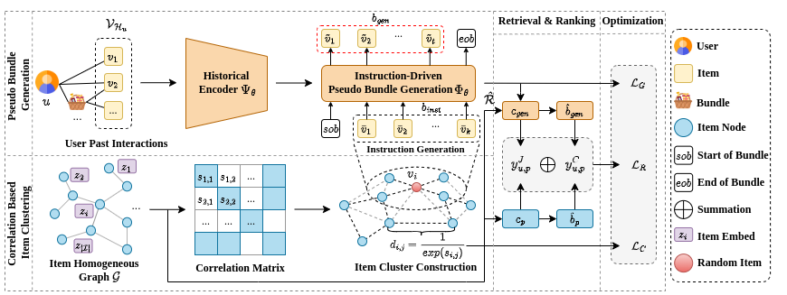

# BRIDGE: Bundle Recommendation via Instruction-Driven Generation

Optimized code written in Flax (a jax deep learning lib)

    

Dataset split:
- user-bundle interaction split into 3 parts train/test/valid `[0.7/0.2/0.1]`

Generated files by our frameworks:
- Model weight are saved in `main_model.pkl`
- Pseudo bundles are saved in `generated_bundles_list_test.pkl`
- Item feature are saved in `item_feat.npy`

Train model:
`python train.py --dataset [dataset]`
with parameters:
- `epochs`: number of epochs to train main model
- `batch_size`: batch size for pseudo model and main model
- `n_head`: number of heads in multihead attention
- `n_layer`: number of encoder/decoder layers
- `n_dim`: embedding dimension
- `continue_training`: train model with saved weights
- `weight_path`: saved weight path "model_weight.pkl" file

Eval model: 
`python eval.py --dataset [dataset] --topk [topk] --alpha[alpha]`

You can run `train_{dataset}.sh` to train and eval
